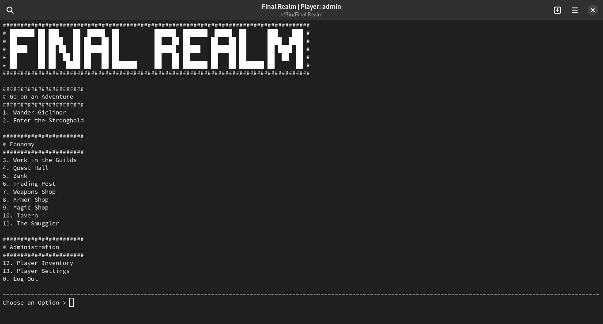

# Final Realm: Remastered

This is a remastering of the original [Final Realm project by brian.](https://finalrealm.weebly.com/index.html)

The original project is written in Batch, an older form of scripting specific to DOS systems.
Final Realm wasn't compatible with the DOS emulators I've tried out (I run Linux), so I
decided to create a re-written version of Final Realm that aims to be cross-compatible with
any platform that runs Bash (will be written in POSIX once the initial logic is squared away).

## Installation/Update/Uninstallation

The following commands will manage the Final Realm Installation

### Final Realm is NOT installed

```bash
bash <(wget -qO- https://raw.githubusercontent.com/rmj1001/final-realm/main/src/final-realm-mgr)
```

### Final Realm IS installed

```bash
final-realm-mgr
```

## How to run Final Realm

Once installed, just run the below command anywhere.

```bash
final-realm
```

## Screenshots

[Click here to see game screenshots.](screenshots/)


